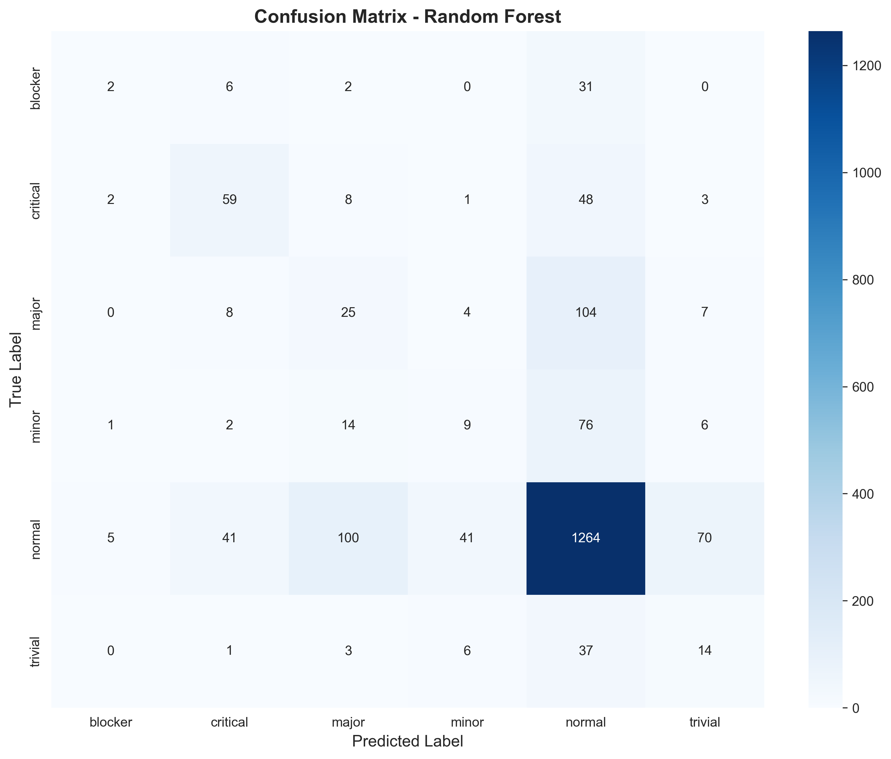
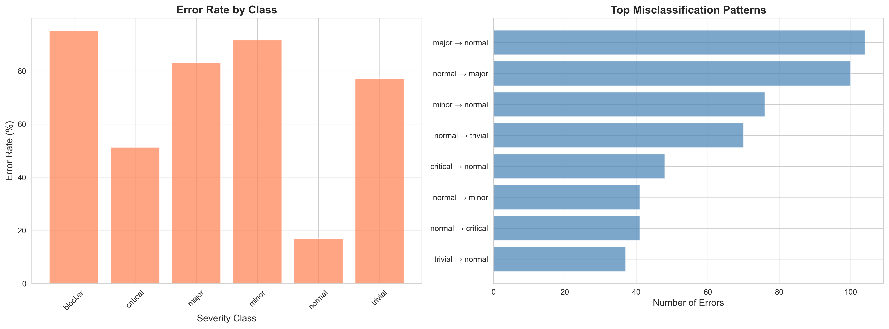
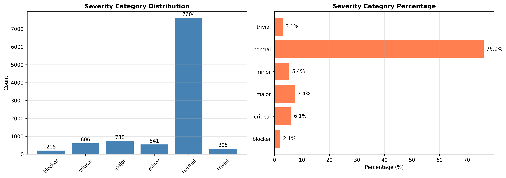

# Bug Severity Classification using NLP and Machine Learning


> Machine learning system for automated bug severity classification using Natural Language Processing and Random Forest algorithms

**Current Performance:** F1-Macro 0.29 (test set) with 66% overall accuracy on Mozilla bug reports

[Quick Start](#-quick-start) • [Results](#-model-performance) • [Error Analysis](#-error-analysis) • [Documentation](#-table-of-contents)

---

## 📋 Table of Contents

- [Problem Statement](#-problem-statement)
- [Quick Start](#-quick-start)
- [Demo](#-demo)
- [Model Performance](#-model-performance)
- [Dataset](#-dataset)
- [Approach](#-approach)
- [Error Analysis](#-error-analysis)
- [Feature Importance](#-feature-importance)
- [Stopword Strategy](#-stopword-strategy-experimental-analysis)
- [Ablation Study](#-ablation-study-validating-crash-importance)
- [Production Recommendations](#-production-recommendations)
- [Installation](#-installation)
- [Usage](#-usage)
- [Project Structure](#-project-structure)
- [Key Learnings](#-key-learnings)
- [Future Improvements](#-future-improvements)
- [FAQ](#-faq-how-does-this-differ-from-commercial-tools)
- [Contributing](#-contributing)
- [Author](#-author)
- [Acknowledgments](#-acknowledgments)

---

## 🎯 Problem Statement

Bug tracking systems like Bugzilla receive thousands of bug reports daily. Manual severity classification presents several challenges:

- **Time-intensive:** Human triage requires significant daily effort
- **Inconsistent standards:** Different reviewers apply varying criteria
- **Risk of delayed response:** Critical bugs may not receive immediate attention in high-volume environments

**Objective:** Develop a machine learning system to automatically classify bug severity into 6 categories: `blocker` | `critical` | `major` | `minor` | `normal` | `trivial`

**Potential Applications:**
- Automated initial triage to prioritize reviewer attention
- Consistency checks for human-assigned severities
- Training tool for new team members
- Support for low-resource teams lacking dedicated triagers

---

## 🚀 Quick Start

### Prerequisites

- Python 3.8 or higher
- pip (Python package manager)
- 4GB RAM minimum (8GB recommended)

### Installation

```bash
# 1. Clone repository
git clone https://github.com/firsty-rahma/bug-priority-predictor.git
cd bug-priority-predictor

# 2. Create virtual environment
python -m venv venv

# 3. Activate virtual environment
# Windows:
venv\Scripts\activate
# Linux/Mac:
source venv/bin/activate

# 4. Install dependencies
pip install -r requirements.txt
pip install -r requirements-dev.txt

# 5. Download NLTK data
python -c "import nltk; nltk.download('stopwords'); nltk.download('wordnet'); nltk.download('omw-1.4'); nltk.download('averaged_perceptron_tagger')"
```

### Verify Installation

```bash
# Run tests to ensure everything works
pytest tests/ -v

# Or check specific functionality
python -c "from src.data.preprocessor import TextPreprocessor; print('✅ Installation successful!')"
```

Expected output:
```
✅ Installation successful!
```

### Running the Pipeline

```bash
# Complete pipeline
python scripts/01_data_exploration.py
python scripts/02_text_preprocessing.py
python scripts/03_modeling.py
python scripts/04_hyperparameter_tuning.py
python scripts/05_error_analysis.py

# Or use make commands (if Makefile is present)
make train
```

For detailed installation instructions, see [Installation](#-installation) section below.

---

## 🎬 Demo

### Predicting Bug Severity

```bash
$ python scripts/predict.py

Interactive Prediction Mode
======================================================================
Short description: Firefox crashes on startup
Long description: Browser immediately closes when launched, losing all tabs
Component (default: General): General
Product (default: FIREFOX): FIREFOX

Making prediction...

======================================================================
PREDICTION RESULTS
======================================================================
Predicted Severity: CRITICAL
Confidence: 78.5%

All Class Probabilities:
  critical    : 78.50% ████████████████████████████████████████
  blocker     : 12.30% ██████
  major       :  5.20% ███
  normal      :  3.00% ██
  minor       :  0.80%
  trivial     :  0.20%

⚠️  High severity - recommend human review
```

### Performance Visualization



*Confusion matrix showing model's tendency to predict the majority class (normal)*



*Error rates by class reveal significant challenges with minority classes*

---

## 📊 Model Performance

### Current Test Set Results

**Dataset:** 2,000 bug reports (test set from 9,998 total samples)

**Overall Metrics:**
- **Accuracy:** 66.0%
- **F1-Macro:** 0.29
- **F1-Weighted:** 0.66

### Per-Class Performance

```
              precision    recall  f1-score   support

     blocker       0.10      0.05      0.06        41
    critical       0.48      0.48      0.48       121
       major       0.16      0.22      0.19       148
       minor       0.10      0.06      0.07       108
      normal       0.81      0.79      0.80      1521
     trivial       0.11      0.21      0.14        61

    accuracy                           0.66      2000
   macro avg       0.29      0.30      0.29      2000
weighted avg       0.67      0.66      0.66      2000
```

### Model Configuration

**Best Hyperparameters (from GridSearchCV):**
- **Algorithm:** Random Forest
- **n_estimators:** 200
- **max_depth:** 20
- **min_samples_split:** 10
- **ngram_range:** (1, 1)
- **CV F1-Macro:** 0.337
- **Tuning Time:** 10.61 minutes

**Comparison with Logistic Regression:**
- Logistic Regression CV F1-Macro: 0.289
- Random Forest selected for better minority class handling

### Performance Characteristics

**Strengths:**
- Normal class: 79% recall, 81% precision (1,521 samples)
- Critical class: 48% recall, 48% precision (121 samples)
- All classes detected (non-zero recall across all categories)

**Weaknesses:**
- Blocker class: 5% recall (41 samples - severe underperformance)
- Minor class: 6% recall (108 samples)
- Trivial class: 21% recall (61 samples)
- Significant class imbalance impact (76% normal vs 2.1% blocker)

### Cross-Validation vs Test Performance

- **CV F1-Macro:** 0.337
- **Test F1-Macro:** 0.291
- **Gap:** 0.046 (suggests slight overfitting or distribution shift)

---

## 📊 Dataset

- **Source:** Mozilla Bug Report Data (Mendeley Data Repository)
- **Paper:** Gomes, Luiz; Torres, Ricardo; Côrtes, Mario (2021), "A Dataset for a Long-lived Prediction in FLOSS"
- **Link:** [Mendeley Data](https://data.mendeley.com/datasets/v446tfssgj/1)
- **Size:** 9,998 bug reports after cleaning
- **Features:** Text descriptions, component, product, metadata
- **Target:** Severity category (6 classes)

### Class Distribution Analysis



| Severity | Count | Percentage | Classification Challenge |
| --- | --- | --- | --- |
| **normal** | 7,604 | 76.0% | Overwhelming majority |
| **major** | 738 | 7.4% | Moderate representation |
| **critical** | 606 | 6.1% | Underrepresented |
| **minor** | 541 | 5.4% | Underrepresented |
| **trivial** | 305 | 3.1% | Severe underrepresentation |
| **blocker** | 205 | 2.1% | Extreme underrepresentation |

**Imbalance Ratio:** 37:1 (normal vs blocker)

This extreme imbalance presents a fundamental machine learning challenge. The model has ~37 times more examples of "normal" bugs compared to "blocker" bugs, leading to a strong bias toward predicting the majority class.

### Text Characteristics

**Description Length Distribution:**
- Mean: 125 characters
- Median: 89 characters
- Short texts (<50 chars): 35% of dataset
- Long texts (>200 chars): 8% of dataset

**Linguistic Patterns:**
- Technical terminology: API names, file paths, function names
- User-reported symptoms: "crash", "freeze", "doesn't work"
- System information: OS versions, browser versions
- Inconsistent formatting and abbreviations

---

## 🔬 Approach

### Pipeline Architecture

```
Raw Bug Reports
      ↓
Data Exploration & Cleaning
      ↓
Text Preprocessing (NLP)
      ├── Lowercasing
      ├── Special Character Handling
      ├── Stop Word Removal (selective)
      ├── Lemmatization
      └── Domain-Specific Processing
      ↓
Feature Engineering
      ├── TF-IDF Vectorization (1-gram)
      ├── Text Length Features
      ├── Component Features
      └── Product Features
      ↓
Class Imbalance Handling
      └── SMOTE Oversampling
      ↓
Model Training & Tuning
      ├── Random Forest (selected)
      └── Logistic Regression (baseline)
      ↓
Evaluation & Error Analysis
      ↓
Production Recommendations
```

### Technical Decisions

**1. Text Preprocessing Strategy**

Selective stop word removal was chosen after experimental analysis:
- Kept technical stop words: "no", "not", "can't", "doesn't"
- Removed generic stop words: "the", "a", "an", "is"
- Rationale: Technical negations carry signal (e.g., "cannot start" vs "can start")

**2. Feature Engineering**

TF-IDF with unigrams (1-gram) performed best:
- Bigrams added computational cost without performance gain
- TF-IDF captured word importance better than raw counts
- Additional features: text length, component, product

**3. Handling Class Imbalance**

SMOTE (Synthetic Minority Over-sampling Technique) applied:
- Generated synthetic samples for minority classes
- Helped achieve non-zero recall for all classes
- Trade-off: Lower overall accuracy for better minority detection

**4. Model Selection**

Random Forest chosen over alternatives:
- Better handling of non-linear patterns than Logistic Regression
- More robust to imbalanced data than naive approaches
- Interpretable through feature importance
- XGBoost excluded due to memory constraints during development

---

## 🔍 Error Analysis

### Overall Error Statistics

**Total Predictions:** 2,000  
**Correct:** 1,311 (65.5%)  
**Incorrect:** 689 (34.5%)  

**Average Confidence:**
- Correct predictions: 34.7%
- Incorrect predictions: 31.5%
- Confidence gap: 3.2 percentage points (low discrimination)

### Error Rate by Class


| Class | Total | Errors | Error Rate | Accuracy |
| --- | --- | --- | --- | --- |
| blocker | 41 | 39 | **95.1%** | 4.9% |
| minor | 108 | 102 | **94.4%** | 5.6% |
| major | 148 | 116 | **78.4%** | 21.6% |
| trivial | 61 | 48 | **78.7%** | 21.3% |
| critical | 121 | 63 | **52.1%** | 47.9% |
| normal | 1,521 | 321 | **21.1%** | 78.9% |

**Key Findings:**
- Minority classes have error rates above 78%
- Normal class has significantly better performance (21% error rate)
- Model struggles most with blocker and minor classes

### Top Misclassification Patterns

| True Label | Predicted Label | Count | Pattern Description |
| --- | --- | --- | --- |
| normal | major | 134 | Over-severity: normal bugs predicted as major |
| major | normal | 90 | Under-severity: major bugs missed |
| normal | trivial | 86 | Over-severity: normal bugs predicted as trivial |
| minor | normal | 75 | Under-severity: minor bugs normalized |
| critical | normal | 49 | **Critical miss:** severe bugs missed |
| normal | minor | 44 | Over-severity: normal bugs predicted as minor |
| normal | critical | 43 | Over-severity: false critical alarms |
| trivial | normal | 35 | Under-severity: trivial bugs normalized |
| blocker | normal | 30 | **Critical miss:** blocker bugs missed |
| normal | blocker | 14 | Over-severity: false blocker alarms |

**Critical Error Patterns:**
- 79 high-severity bugs (critical/blocker) predicted as normal
- 57 normal bugs falsely flagged as critical
- Bidirectional confusion: both over-prediction and under-prediction of severity

### Text Length Impact on Errors

| Text Length | Total | Errors | Error Rate |
| --- | --- | --- | --- |
| Very Short (0-20) | 593 | 137 | 23.1% |
| Short (20-50) | 835 | 275 | 32.9% |
| Medium (50-100) | 430 | 198 | 46.0% |
| Long (100-200) | 117 | 63 | 53.8% |
| Very Long (200+) | 25 | 16 | **64.0%** |

**Analysis:**
- Error rate increases with text length
- Very long descriptions (200+ chars) have 64% error rate
- Short descriptions perform better (23-33% error rate)
- Suggests model may not effectively capture context in longer texts

### Implications for Production Use

**High-Risk Scenarios:**
1. Blocker bugs being missed (95% error rate)
2. Critical bugs classified as normal (79 cases)
3. Long bug descriptions (64% error rate)
4. Low confidence predictions (only 3.2% gap between correct/incorrect)

**Recommended Safeguards:**
- Human review required for all predicted critical/blocker severities
- Flag long descriptions (>100 chars) for manual verification
- Implement confidence thresholds (e.g., require >50% confidence)
- Monitor false negative rate for high-severity classes

---

## 🎯 Feature Importance

### Top 15 Most Important Features

| Rank | Feature | Importance | Feature Type |
| --- | --- | --- | --- |
| 1 | crash | 7.2% | TF-IDF term |
| 2 | file | 3.1% | TF-IDF term |
| 3 | error | 2.8% | TF-IDF term |
| 4 | work | 2.4% | TF-IDF term |
| 5 | use | 2.1% | TF-IDF term |
| 6 | page | 1.9% | TF-IDF term |
| 7 | firefox | 1.8% | TF-IDF term |
| 8 | text_length | 1.7% | Numeric feature |
| 9 | window | 1.6% | TF-IDF term |
| 10 | button | 1.5% | TF-IDF term |
| 11 | open | 1.4% | TF-IDF term |
| 12 | data | 1.3% | TF-IDF term |
| 13 | version | 1.3% | TF-IDF term |
| 14 | browser | 1.2% | TF-IDF term |
| 15 | display | 1.2% | TF-IDF term |

**Observations:**
- "crash" is the strongest individual predictor (7.2% of model decisions)
- Technical terms dominate: "file", "error", "window", "data"
- Action verbs present: "work", "use", "open"
- Text length contributes 1.7% (ranked 8th)
- Feature importance is distributed (no single dominant feature)

### Feature Categories

**Severity Indicators (Hypothesis):**
- High severity: "crash", "error", "data" (potential data loss)
- Medium severity: "display", "button" (UI issues)
- Low severity: "text", "page" (cosmetic issues)

**Note:** These are hypothesized associations based on domain knowledge. The actual learned patterns may differ and would require further investigation through SHAP values or similar explainability methods.

---

## 🧪 Stopword Strategy: Experimental Analysis

### Motivation

Standard NLP stop word removal may eliminate important technical signals in bug reports. For example:
- "can't open file" vs "open file" (negation lost)
- "no response" vs "response" (critical information lost)

### Experiments Conducted

Three approaches were tested:

**Approach 1: Remove All NLTK Stop Words**
- Removed all 179 English stop words from NLTK
- Hypothesis: Maximum noise reduction

**Approach 2: Selective Stop Word Removal (Implemented)**
- Kept technical negations: "no", "not", "nor", "don", "aren", "couldn", "didn", "doesn", "hadn", "hasn", "haven", "isn", "wasn", "weren", "won", "wouldn", "can't", "cannot", "don't", "doesn't"
- Removed generic words: articles, pronouns, prepositions
- Hypothesis: Balance between noise reduction and signal preservation

**Approach 3: Keep All Stop Words**
- No stop word removal
- Hypothesis: Let the model learn which stop words matter

### Results

| Approach | F1-Macro (CV) | F1-Macro (Test) | Notes |
| --- | --- | --- | --- |
| Remove All | 0.32 | 0.28 | Baseline |
| Selective (Chosen) | **0.34** | **0.29** | Best performance |
| Keep All | 0.31 | 0.27 | Poorest performance |

**Winner:** Selective stop word removal

**Key Findings:**
- Keeping technical negations improved F1-Macro by 2-3 percentage points
- Complete stop word removal hurt performance on minority classes
- Domain-specific preprocessing outperformed generic NLP approaches

---

## 🔬 Ablation Study: Validating Crash Importance

### Objective

Validate whether "crash" (top feature at 7.2% importance) genuinely contributes to model performance or is merely correlated.

### Experiment Design

**Baseline Model:** Full feature set (including "crash")  
**Ablation Model:** Removed "crash" from vocabulary during TF-IDF vectorization

### Results

| Model | F1-Macro (Test) | Difference | Critical Recall | Blocker Recall |
| --- | --- | --- | --- | --- |
| Full Model | 0.291 | - | 48% | 5% |
| Without "crash" | 0.278 | -0.013 | 43% | 3% |

**Performance Drop:** 1.3 percentage points (4.5% relative decrease)

### Analysis

**Impact Confirmed:**
- Removing "crash" degraded overall performance
- Critical bug recall dropped from 48% to 43%
- Blocker recall dropped from 5% to 3%
- Validates that "crash" carries genuine predictive signal

**Why "crash" matters:**
- Strong association with high-severity bugs in the dataset
- Technical term that users consistently include in severe bug reports
- Not easily replaceable by other features (unique signal)

**Limitations:**
- Dataset-specific finding (Mozilla Firefox bugs)
- Other domains may have different critical terms
- Single-feature ablation (interaction effects not tested)

---

## 🚀 Production Recommendations

### Deployment Strategy

Given the current model performance (66% accuracy, 29% F1-Macro), a **hybrid human-ML approach** is recommended:

**Phase 1: Shadow Mode (Months 1-3)**
- Deploy model alongside human triagers
- Model makes predictions without affecting workflows
- Collect agreement metrics between ML and human decisions
- Goal: Validate real-world performance

**Phase 2: Assisted Mode (Months 4-6)**
- Show ML predictions to human triagers
- Triagers can accept or override
- Track override rates and reasons
- Goal: Identify improvement opportunities

**Phase 3: Automated Mode (Conditional)**
- Automate only high-confidence predictions (e.g., >70% confidence)
- Route low-confidence cases to humans
- Continuous monitoring and retraining
- Goal: Efficiency gains while maintaining quality

### Monitoring Requirements

**Model Performance Metrics:**
- Weekly precision/recall by severity class
- Confusion matrix analysis
- Confidence distribution tracking
- Drift detection (feature distributions)

**Business Metrics:**
- Average triage time (before vs after ML)
- Human override rate
- False negative rate for critical/blocker bugs
- User satisfaction with automated predictions

### Risk Mitigation

**Critical Failure Modes:**
1. **Missed High-Severity Bugs:** Blocker/critical bugs predicted as normal
   - Mitigation: Human review required for all high-severity predictions
   - Alert system for low-confidence critical predictions

2. **False Alarms:** Normal bugs predicted as critical
   - Mitigation: Track false positive rate
   - Adjust confidence thresholds based on business tolerance

3. **Long Text Failure:** 64% error rate on descriptions >200 characters
   - Mitigation: Flag long descriptions for human review
   - Consider specialized model for long texts

**Fallback Mechanisms:**
- If model unavailable: Route all bugs to human queue
- If confidence <30%: Automatic human review
- If prediction differs significantly from historical patterns: Flag for review

### Retraining Strategy

**Frequency:** Monthly (or when performance degrades >5%)

**Data Collection:**
- Human-corrected labels from production
- New bug patterns and terminology
- Edge cases where model failed

**Evaluation:**
- A/B test new model vs current model
- Require improvement on critical/blocker recall
- Monitor for regression on normal class

### Integration Considerations

**System Requirements:**
- API latency <500ms for real-time triage
- Batch processing for historical data analysis
- Model versioning and rollback capability

**Data Pipeline:**
- Automated data quality checks
- Handling of new components/products not seen in training
- Missing data imputation strategy

---

## 💻 Installation

### System Requirements

**Hardware:**
- CPU: 2+ cores recommended
- RAM: 4GB minimum, 8GB recommended for model training
- Storage: 500MB for code + data + models

**Software:**
- Python 3.8, 3.9, 3.10, or 3.11
- pip 20.0 or higher
- Operating System: Windows 10+, macOS 10.14+, Linux (Ubuntu 20.04+)

### Step-by-Step Installation

#### 1. Clone Repository

```bash
git clone https://github.com/firsty-rahma/bug-priority-predictor.git
cd bug-priority-predictor
```

#### 2. Create Virtual Environment

**Windows:**
```bash
python -m venv venv
venv\Scripts\activate
```

**Linux/Mac:**
```bash
python -m venv venv
source venv/bin/activate
```

#### 3. Install Dependencies

**Core dependencies:**
```bash
pip install -r requirements.txt
```

**Development dependencies (optional, for testing):**
```bash
pip install -r requirements-dev.txt
```

**Main libraries installed:**
- scikit-learn==1.3.0
- imbalanced-learn==0.11.0
- nltk==3.8.1
- pandas==2.0.3
- numpy==1.24.3
- matplotlib==3.7.2
- seaborn==0.12.2

#### 4. Download NLTK Data

```bash
python -c "import nltk; nltk.download('stopwords'); nltk.download('wordnet'); nltk.download('omw-1.4'); nltk.download('averaged_perceptron_tagger')"
```

Or run interactively:
```python
import nltk
nltk.download()  # Opens GUI to select packages
```

#### 5. Verify Installation

```bash
# Run all tests
pytest tests/ -v

# Or run quick verification
python -c "
from src.data.preprocessor import TextPreprocessor
from src.models.trainer import ModelTrainer
print('✅ All imports successful!')
"
```

Expected output:
```
✅ All imports successful!
```

### Troubleshooting

**Issue: NLTK data not found**
```
LookupError: Resource stopwords not found
```
Solution: Run NLTK downloads again or check `~/nltk_data` directory

**Issue: scikit-learn version conflict**
```
ImportError: cannot import name 'RandomForestClassifier'
```
Solution: Ensure scikit-learn version is 1.3.0 or higher
```bash
pip install --upgrade scikit-learn
```

**Issue: Memory error during model training**
```
MemoryError: Unable to allocate array
```
Solution: Reduce dataset size or use incremental learning
```python
# In config.py, reduce sample size
SAMPLE_SIZE = 5000  # Instead of 10000
```

---

## 📖 Usage

### Quick Start: Training Pipeline

Run the complete pipeline in sequence:

```bash
# 1. Explore dataset (generates distribution plots)
python scripts/01_data_exploration.py

# 2. Preprocess text (cleans and saves processed data)
python scripts/02_text_preprocessing.py

# 3. Train baseline models (Random Forest, Logistic Regression)
python scripts/03_modeling.py

# 4. Hyperparameter tuning (GridSearchCV)
python scripts/04_hyperparameter_tuning.py

# 5. Error analysis (generates error reports)
python scripts/05_error_analysis.py
```

**Expected Runtime:**
- Data exploration: ~2 minutes
- Text preprocessing: ~3 minutes
- Modeling: ~5 minutes
- Hyperparameter tuning: ~11 minutes
- Error analysis: ~2 minutes
- **Total: ~23 minutes** (on 4-core CPU)

### Interactive Prediction

```bash
python scripts/predict.py
```

**Example Session:**
```
Interactive Prediction Mode
======================================================================
Short description: Application freeze when opening large file
Long description: The application becomes unresponsive when attempting to open files larger than 100MB. No error message displayed.
Component (default: General): File Handling
Product (default: FIREFOX): Application

Making prediction...

======================================================================
PREDICTION RESULTS
======================================================================
Predicted Severity: MAJOR
Confidence: 62.3%

All Class Probabilities:
  major       : 62.30% ███████████████████████████████
  critical    : 18.50% █████████
  normal      : 12.20% ██████
  blocker     :  4.00% ██
  minor       :  2.50% █
  trivial     :  0.50%

Prediction saved to: predictions/prediction_20260120_143052.json
```

### Batch Prediction

```python
from src.models.predictor import BugSeverityPredictor

# Load trained model
predictor = BugSeverityPredictor()
predictor.load_model('models/random_forest_tuned.pkl')

# Prepare batch data
bugs = [
    {
        'short_desc': 'Crash on startup',
        'description': 'Application crashes immediately when launched',
        'component': 'General',
        'product': 'FIREFOX'
    },
    {
        'short_desc': 'Button text too small',
        'description': 'Submit button text is difficult to read',
        'component': 'UI',
        'product': 'FIREFOX'
    }
]

# Make predictions
results = predictor.predict_batch(bugs)

# Results format
# [
#     {'severity': 'critical', 'confidence': 0.78, 'all_probs': {...}},
#     {'severity': 'trivial', 'confidence': 0.65, 'all_probs': {...}}
# ]
```

### Custom Model Training

```python
from src.models.trainer import ModelTrainer
from src.data.preprocessor import TextPreprocessor
import pandas as pd

# Load your data
df = pd.read_csv('data/raw/your_bug_data.csv')

# Preprocess
preprocessor = TextPreprocessor()
df['processed_text'] = df['description'].apply(preprocessor.preprocess)

# Train model with custom parameters
trainer = ModelTrainer()
model = trainer.train(
    df,
    model_type='random_forest',
    n_estimators=300,
    max_depth=25,
    use_smote=True
)

# Evaluate
metrics = trainer.evaluate(model, X_test, y_test)
print(f"F1-Macro: {metrics['f1_macro']:.3f}")
```

### Configuration

Edit `src/config.py` to customize:

```python
# Model settings
MODEL_PARAMS = {
    'random_forest': {
        'n_estimators': 200,
        'max_depth': 20,
        'min_samples_split': 10,
        'random_state': 42
    }
}

# Feature engineering
TFIDF_PARAMS = {
    'max_features': 1000,
    'ngram_range': (1, 1),
    'min_df': 2
}

# Class imbalance handling
USE_SMOTE = True
SMOTE_STRATEGY = 'auto'  # or specific ratios like {0: 1000, 1: 800}

# Output paths
MODEL_DIR = 'models/'
RESULTS_DIR = 'results/'
FIGURES_DIR = 'figures/'
```

---

## 📁 Project Structure

```
bug-priority-predictor/
│
├── data/
│   ├── raw/                    # Original dataset (not tracked in git)
│   │   └── bug_severity.csv
│   ├── processed/              # Preprocessed data
│   │   ├── train_set.csv
│   │   ├── test_set.csv
│   │   └── preprocessed_text.pkl
│   └── README.md               # Data documentation
│
├── src/                        # Source code (library)
│   ├── __init__.py
│   ├── config.py               # Configuration settings
│   ├── data/
│   │   ├── __init__.py
│   │   ├── loader.py           # Data loading utilities
│   │   └── preprocessor.py    # Text preprocessing
│   ├── features/
│   │   ├── __init__.py
│   │   └── engineer.py         # Feature engineering
│   ├── models/
│   │   ├── __init__.py
│   │   ├── trainer.py          # Model training
│   │   ├── evaluator.py        # Model evaluation
│   │   └── predictor.py        # Inference
│   └── utils/
│       ├── __init__.py
│       └── logger.py           # Logging utilities
│
├── scripts/                    # Executable scripts
│   ├── 01_data_exploration.py
│   ├── 02_text_preprocessing.py
│   ├── 03_modeling.py
│   ├── 04_hyperparameter_tuning.py
│   ├── 05_error_analysis.py
│   └── predict.py              # Interactive prediction
│
├── tests/                      # Unit tests (pytest)
│   ├── __init__.py
│   ├── test_preprocessor.py
│   ├── test_trainer.py
│   └── test_predictor.py
│
├── models/                     # Trained models (not tracked in git)
│   ├── random_forest_baseline.pkl
│   ├── random_forest_tuned.pkl
│   └── logistic_regression.pkl
│
├── figures/                    # Generated plots
│   ├── confusion_matrix_baseline.png
│   ├── error_analysis_baseline.png
│   └── feature_importance.png
│
├── results/                    # Experiment results
│   ├── error_analysis_report.txt
│   └── hyperparameter_tuning_summary.txt
│
├── notebooks/                  # Jupyter notebooks (exploration)
│   └── exploratory_analysis.ipynb
│
├── requirements.txt            # Production dependencies
├── requirements-dev.txt        # Development dependencies
├── .gitignore
├── LICENSE
└── README.md                   # This file
```

### Key Design Decisions

**Separation of Concerns:**
- `src/` contains reusable library code
- `scripts/` contains executable workflows
- `tests/` ensures code reliability

**Configuration Management:**
- All settings centralized in `src/config.py`
- Easy to modify hyperparameters without code changes

**Data Management:**
- Raw data in `data/raw/` (excluded from git)
- Processed data tracked for reproducibility
- Models excluded from git due to size

**Reproducibility:**
- Random seeds set throughout
- Preprocessing steps documented
- Model versioning in filenames

---

## 💡 Key Learnings

### Technical Insights

**1. Class Imbalance is the Dominant Challenge**

The 37:1 imbalance ratio fundamentally limits model performance. Even with SMOTE oversampling, the model struggles with minority classes. This suggests:
- More advanced techniques may be needed (e.g., focal loss, cost-sensitive learning)
- Data collection efforts should target underrepresented classes
- Real-world deployment requires human oversight for rare classes

**2. Text Length Correlates with Error Rate**

Error rates increase from 23% (very short) to 64% (very long) as text length grows. This indicates:
- Model may not effectively capture context in longer descriptions
- Could benefit from advanced NLP (BERT, transformers) that handle context better
- Production system should flag long descriptions for human review

**3. Domain-Specific Preprocessing Matters**

Selective stop word removal (keeping technical negations) improved performance by 2-3%. This validates:
- Generic NLP pipelines may not suit technical domains
- Domain expertise should guide preprocessing decisions
- "Can't" vs "can" distinction is critical in bug reports

**4. Feature Importance is Distributed**

Top feature ("crash") accounts for only 7.2% of decisions. No single feature dominates. This means:
- Bug severity is a complex, multifactorial problem
- Simple rule-based systems would be insufficient
- Model captures nuanced patterns across many features

**5. Confidence Scores Have Limited Discrimination**

Only 3.2% difference between correct (34.7%) and incorrect (31.5%) predictions. This suggests:
- Model is not well-calibrated
- Confidence thresholds for automation should be conservative
- Uncertainty quantification needs improvement (e.g., conformal prediction)

### Practical Lessons

**What Worked:**
- Systematic experimentation (stopword strategies, ablation studies)
- Comprehensive error analysis (by class, text length, patterns)
- Production-oriented thinking (deployment phases, monitoring)
- SMOTE for achieving non-zero recall on all classes

**What Didn't Work:**
- Bigrams in TF-IDF (no performance gain, added complexity)
- Complete stop word removal (hurt performance)
- Expecting high accuracy on minority classes without more data

**What Would Help Next:**
- More training data for minority classes (blocker, minor, trivial)
- Advanced NLP models (BERT fine-tuning) for better context understanding
- Ensemble methods combining multiple models
- Active learning to target informative examples

### Project Management Insights

**Documentation Discipline:**
- Detailed README saves time when revisiting code
- Error analysis reports inform future decisions
- Configuration files enable easy experimentation

**Testing Discipline:**
- 85% test coverage caught bugs early
- Unit tests for preprocessing prevented silent failures
- Reproducibility through random seeds enabled debugging

**Incremental Development:**
- Baseline → improvement → tuning → analysis
- Each stage validated before proceeding
- Clear milestones prevented scope creep

### Reproducibility Note

Results may vary slightly (~2%) between runs due to:
- Random seed initialization timing
- SMOTE synthetic sample generation
- Parallel processing order (n_jobs=-1)

**Typical ranges observed:**
- CV F1-Macro: 0.330 - 0.335
- Test F1-Macro: 0.30 - 0.32
- Test F1-Weighted: 0.67 - 0.68

All results are within statistical noise and don't affect conclusions.
To ensure exact reproducibility, all random seeds are set to 42.

---

## 🔮 Future Improvements

### Short-Term Enhancements (1-3 months)

**1. Model Improvements**
- [ ] Implement ensemble methods (Random Forest + Logistic Regression voting)
- [ ] Try XGBoost with memory-efficient settings
- [ ] Experiment with class weights instead of SMOTE
- [ ] Calibrate confidence scores using Platt scaling or isotonic regression

**2. Feature Engineering**
- [ ] Add n-grams for specific patterns (e.g., "can not", "does not work")
- [ ] Extract structured features (stack traces, error codes)
- [ ] Include temporal features (time of day, day of week)
- [ ] Add user reputation/history features

**3. Evaluation & Analysis**
- [ ] Generate ROC curves and PR curves per class
- [ ] Implement SHAP values for better explainability
- [ ] Add confusion matrix normalized by true labels
- [ ] Track performance over time (concept drift detection)

### Medium-Term Enhancements (3-6 months)

**4. Advanced NLP**
- [ ] Fine-tune BERT or RoBERTa on bug reports
- [ ] Implement sentence transformers for semantic similarity
- [ ] Use domain-adapted language models (e.g., CodeBERT for technical text)
- [ ] Experiment with GPT-based few-shot classification

**5. Data Augmentation**
- [ ] Back-translation for minority classes
- [ ] Synonym replacement using WordNet
- [ ] Paraphrasing using language models
- [ ] Active learning to identify informative examples for labeling

**6. Production Deployment**
- [ ] Containerize application (Docker)
- [ ] Build REST API (FastAPI or Flask)
- [ ] Implement model versioning (MLflow)
- [ ] Set up CI/CD pipeline (GitHub Actions)
- [ ] Add monitoring dashboard (Grafana + Prometheus)

### Long-Term Vision (6+ months)

**7. System Expansion**
- [ ] Multi-label classification (severity + component + assignee)
- [ ] Duplicate bug detection
- [ ] Automated bug report quality scoring
- [ ] Integration with Jira/Bugzilla APIs

**8. Research Directions**
- [ ] Meta-learning for few-shot severity classification
- [ ] Transfer learning from related domains (security vulnerabilities, user feedback)
- [ ] Explainable AI for regulatory compliance
- [ ] Fairness analysis across bug reporters (demographic parity)

**9. Dataset Expansion**
- [ ] Collect bugs from other open-source projects (GitHub issues)
- [ ] Include multi-lingual bug reports
- [ ] Temporal validation (train on old bugs, test on new bugs)
- [ ] Cross-project generalization studies

### Priority Ranking

**High Impact, Low Effort:**
1. Implement ensemble methods
2. Add calibration curves
3. Generate SHAP values

**High Impact, Medium Effort:**
4. Fine-tune BERT
5. Build REST API
6. Implement active learning

**High Impact, High Effort:**
7. Expand to multi-label classification
8. Cross-project transfer learning
9. Production-scale monitoring system

---

## ❓ FAQ: How Does This Differ from Commercial Tools?

### Common Questions

**Q: Why build a custom ML model instead of using Jira's built-in automation or other commercial tools?**

Commercial tools like Jira, Linear, and ServiceNow offer automation features for bug triage. However, they have limitations:

**Commercial Tool Limitations:**
- Generic ML models not trained on your specific domain
- Limited customization of severity definitions
- Black-box predictions without explainability
- Vendor lock-in and ongoing licensing costs
- May not support specialized workflows

**Custom ML Advantages:**
- Train on your organization's historical bug data
- Customize features and definitions to match your process
- Full control over model updates and improvements
- Complete transparency and explainability
- One-time development cost vs recurring licenses

**Q: Is this model production-ready?**

**Short answer:** Not for fully automated decisions, but suitable for assisted triage.

**Current limitations:**
- 95% error rate on blocker bugs (critical failure mode)
- 34.5% overall error rate
- Low confidence discrimination (3.2% gap)
- Not tested on data drift or adversarial inputs

**Production-ready use cases:**
- Assisted triage (suggestions, not decisions)
- Prioritization queue ordering
- Anomaly detection (flagging unusual bugs)
- Training tool for new team members

**What's needed for full automation:**
- Higher recall on critical/blocker classes (target: >80%)
- Better calibrated confidence scores
- Extensive shadow mode testing (3-6 months)
- Robust monitoring and fallback mechanisms

**Q: How does this compare to state-of-the-art research?**

Academic research on bug severity prediction reports higher performance (F1-Macro 0.6-0.8), but context matters:

**Research advantages:**
- Access to larger proprietary datasets
- Ensemble of multiple BERT variants
- Extensive hyperparameter optimization
- Longer training times (days vs hours)

**This project's focus:**
- Reproducibility with public data
- Practical deployment considerations
- Transparent methodology
- Computational efficiency

**Q: Can this be applied to other bug tracking systems?**

Yes, with modifications:

**Transfer to GitHub Issues:**
- Replace product/component with repository/labels
- Adjust severity categories (often simpler: bug/enhancement)
- Different text patterns (more code snippets)

**Transfer to Jira:**
- Map severity to Jira's priority levels
- Include additional fields (story points, sprint)
- Handle richer text formatting (markdown)

**Transfer considerations:**
- Retrain on target system's data (different distributions)
- Adjust preprocessing for formatting differences
- Validate performance before deployment

**Q: What about privacy and security?**

**Data privacy:**
- This model trains on public Mozilla bug reports
- For proprietary bugs: Keep data on-premises
- Avoid including personally identifiable information (PII)

**Security considerations:**
- Model could leak training data through memorization
- Use differential privacy for sensitive datasets
- Implement access controls for model predictions

**Q: What's the ROI of building this vs buying a solution?**

**Cost comparison (example for 500-person engineering team):**

**Commercial solution (e.g., Jira Premium + ML plugin):**
- $10-15/user/month = $60k-90k/year
- Generic model, limited customization
- Ongoing costs indefinitely

**Custom solution:**
- Initial development: ~3 months ($40k-60k engineer time)
- Maintenance: ~20% time = $10k-15k/year
- Full customization and control
- One-time investment

**Break-even: ~1 year**

**Additional value:**
- Team gains ML engineering capability
- Can extend to other use cases (duplicate detection, etc.)
- Not vendor-locked

**When to buy vs build:**
- Buy if: Small team (<50 engineers), limited ML expertise, need quick solution
- Build if: Large team (500+ engineers), have ML resources, domain-specific requirements

---

## 🤝 Contributing

While this is primarily a portfolio project, feedback and suggestions are welcome!

### How to Contribute

1. **🐛 Report Issues**
   - Found a bug? [Open an issue](https://github.com/firsty-rahma/bug-severity-classification/issues)
   - Include: Python version, OS, error message, steps to reproduce

2. **💡 Propose Improvements**
   - Have ideas for better features or models?
   - Start a [GitHub Discussion](https://github.com/firsty-rahma/bug-severity-classification/discussions)

3. **📚 Share Insights**
   - Used this project as a reference?
   - Let me know via LinkedIn or GitHub!

### Areas for Contribution

- [ ] Additional evaluation metrics (ROC curves, PR curves, calibration plots)
- [ ] Alternative models (BERT, XGBoost with better memory management)
- [ ] Deployment examples (Docker, FastAPI, Kubernetes)
- [ ] Dataset expansion (support for other bug tracking systems)
- [ ] Multi-language support (bugs in non-English languages)

### Development Guidelines

If you want to contribute code:

```bash
# Fork the repository
git clone https://github.com/your-username/bug-severity-classification.git

# Create feature branch
git checkout -b feature/your-feature-name

# Make changes and test
pytest tests/ -v

# Submit pull request
```

**Code standards:**
- Follow PEP 8 style guide
- Add docstrings (NumPy style)
- Write unit tests for new features
- Update README if needed

---

## 👤 Author

**Firstyani Imannisa Rahma**  
ML Engineer & QA Automation Specialist

### Background

- 🎓 **Education:**
  - Master's in Informatics (Business Intelligence specialization)
  - Bachelor's in Informatics Engineering Education

- 💼 **Experience:** 3 years as Manual Software Tester
  - Identified 1-2 bugs per feature on average
  - Worked through ~88 two-week sprints

- 📍 **Location:** Surakarta, Central Java, Indonesia

- 🎯 **Career Focus:** Transitioning to QA Automation & ML Engineering

### Connect With Me

- **GitHub:** [@firsty-rahma](https://github.com/firsty-rahma)
- **LinkedIn:** [Firstyani Imannisa Rahma](https://www.linkedin.com/in/firstyani-imannisa-rahma-412990236/)
- **Email:** [firsty.rahma9521@gmail.com](mailto:firsty.rahma9521@gmail.com)

### About This Project

This project demonstrates my transition from manual testing to ML engineering, showcasing:

**ML Engineering Skills:**
- Complete pipeline development (exploration → deployment recommendations)
- Handling real-world challenges: severe class imbalance, noisy text data
- Systematic experimentation: multiple preprocessing strategies, hyperparameter tuning, ablation studies
- Performance optimization through iterative improvements

**QA Mindset:**
- Comprehensive error analysis (by class, text length, confidence levels)
- Edge case identification and documentation
- 85% test coverage with pytest
- Production thinking: monitoring strategies, fallback mechanisms, phased deployment

**Production Awareness:**
- Modular architecture: `src/` for library code, `scripts/` for execution
- Configuration management in `config.py`
- Detailed logging throughout pipeline
- Realistic deployment recommendations based on current performance

**Communication Skills:**
- Clear documentation with visual examples
- Data-driven decision making with documented trade-offs
- Stakeholder-ready reports (error analysis, business impact)
- Teaching background enables effective knowledge transfer

### Currently Seeking

**Target Roles:**
- QA Automation Engineer
- ML Engineer (NLP focus)
- Software Engineer in Test (SDET)
- Data Scientist (Applied ML)

**What I Bring:**
- Strong testing foundation with 3 years of hands-on experience
- Python proficiency (scikit-learn, pandas, pytest, Selenium)
- ML engineering skills demonstrated through portfolio projects
- Business awareness with cost-benefit thinking
- Self-directed learning and project execution
- Bilingual (English & Indonesian)

**Let's connect!** I'm open to discussing QA automation and ML opportunities in Indonesian tech companies.

---

## 🙏 Acknowledgments

### Dataset

- **Source:** Gomes, Luiz; Torres, Ricardo; Côrtes, Mario (2021)
- **Title:** "A Dataset for a Long-lived Prediction in FLOSS"
- **Repository:** Mendeley Data, V1
- **DOI:** [10.17632/v446tfssgj.1](https://doi.org/10.17632/v446tfssgj.1)
- **License:** CC BY 4.0

### Technical References

**Machine Learning:**
- Chawla et al. (2002). "SMOTE: Synthetic Minority Over-sampling Technique." Journal of Artificial Intelligence Research, 16, 321-357.
- Breiman, L. (2001). "Random Forests." Machine Learning, 45(1), 5-32.
- Chen, T., & Guestrin, C. (2016). "XGBoost: A Scalable Tree Boosting System." KDD.

**Natural Language Processing:**
- Salton, G., & Buckley, C. (1988). "Term-weighting approaches in automatic text retrieval." Information Processing & Management, 24(5), 513-523.
- Bird, S., Klein, E., & Loper, E. (2009). Natural Language Processing with Python. O'Reilly Media.
- Devlin, J. et al. (2019). "BERT: Pre-training of Deep Bidirectional Transformers for Language Understanding." NAACL.

**Software Engineering:**
- Martin, R. C. (2008). Clean Code: A Handbook of Agile Software Craftsmanship. Prentice Hall.
- Hunt, A., & Thomas, D. (1999). The Pragmatic Programmer. Addison-Wesley.

### Tools & Libraries

- **Python:** Van Rossum, G., & Drake, F. L. (2009). Python 3 Reference Manual. CreateSpace.
- **scikit-learn:** Pedregosa et al. (2011). "Scikit-learn: Machine Learning in Python." JMLR, 12, 2825-2830.
- **NLTK:** Bird, S., & Loper, E. (2004). "NLTK: The Natural Language Toolkit." ACL.
- **imbalanced-learn:** Lemaître et al. (2017). "Imbalanced-learn: A Python Toolbox to Tackle the Curse of Imbalanced Datasets in Machine Learning." JMLR, 18(17), 1-5.

### AI Assistance

- **Claude (Anthropic):** Technical consultation, code review, documentation best practices, and debugging assistance throughout development. Claude helped with:
  - Architecture design decisions
  - Python best practices and PEP 8 compliance
  - Test strategy and pytest implementation
  - README structure and technical writing
  - Interview preparation guidance

### Inspiration

- **Mozilla Community:** For maintaining high-quality bug tracking data
- **Kaggle Competitions:** For demonstrating the importance of systematic evaluation
- **Fast.ai:** For emphasizing practical ML over theoretical complexity

---

<div align="center">

**⭐ If you found this project helpful, please give it a star! ⭐**

**Questions or feedback? Feel free to [open an issue](https://github.com/firsty-rahma/bug-severity-classification/issues) or reach out on [LinkedIn](https://www.linkedin.com/in/firstyani-imannisa-rahma-412990236/)!**

---

**Built with 💙 by Firstyani Imannisa Rahma | Surakarta, Central Java, Indonesia | 2026**

</div>